<!-- _class: cover -->
<!-- _paginate: skip -->
# きのこ観察の視点から見た再度公園の環境
# 
### 発表者: 渡邉大輔 ／ 日付: 2025-11-9

---
<!-- _class: content -->

## 趣旨
- 再度公園という場所・環境を知る
- 観察記録等を読み解く

---
<!-- _class: divider -->

# 再度公園の概要

---
<!-- _class: content nature-slide -->

## 再度公園の自然環境

  

    <ul>
      <li>再度公園周辺ではアカマツ林が広く分布し、林内にはソヨゴやヒサカキ、スダジイの低木もみられる。気候的極相としては、スダジイやアカガシを主体とする照葉樹林が発達する地域である。</li>
      <li>花崗岩が風化してできた砂質の土壌が広がり、水はけがよい反面、水もちが悪く乾燥しやすい環境を形成。アカマツ林ではpHがより酸性で、スダジイ林よりも土壌が未熟。</li>
    </ul>
  

---
<!-- _class: media -->

  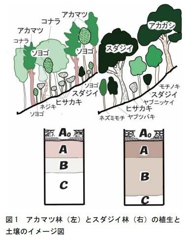

<footer class="source-note">
  
出典: 小舘 誓治（年不明）『自然とむきあう — 六甲山系における森林の植生と土壌を調べる』 https://www.hitohaku.jp/publication/30thanniv_10_rokkomt.pdf

  
出典: 高橋竹彦・増田隆史・西川清（1987）『六甲山地再度山永久植生保存地における植物群落の遷移と土壌の理化学性との関係』 https://www.jstage.jst.go.jp/article/jjfe/29/2/29_KJ00006918313/_pdf/-char/ja

</footer>

---
<!-- _class: media -->

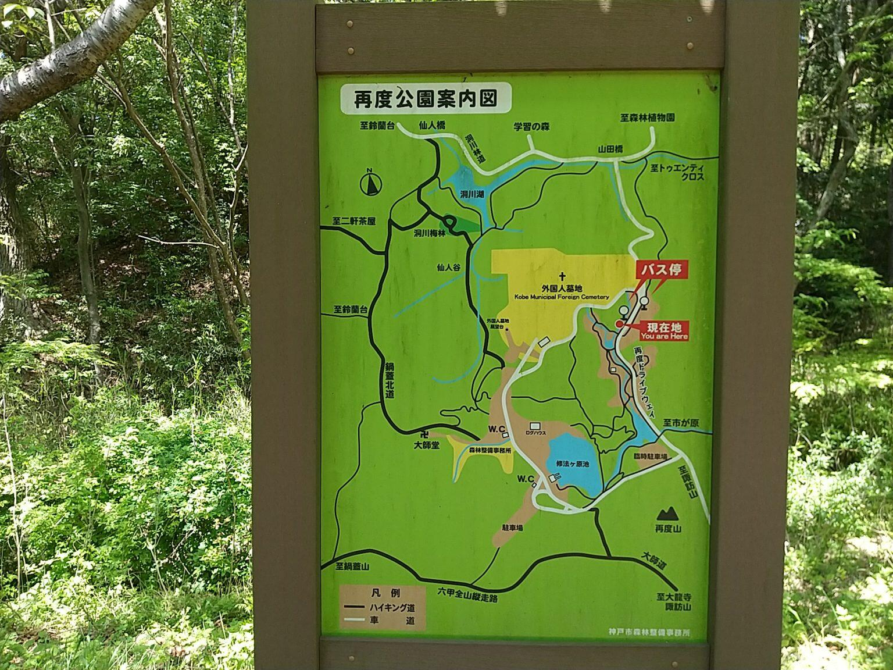

<footer class="source-note">
  
出典: 神戸まちガイド（2023）『再度公園 ― 神戸 まちガイド』 https://kobe-machiguide.com/park/futatabi-park/

</footer>

---
<!-- _class: media -->

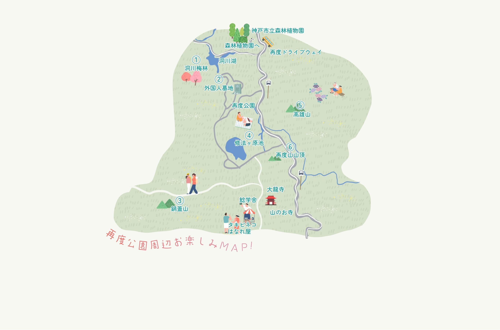

<footer class="source-note">
  
出典: ルートふたたび（2023）『再度公園について – Futatabi Park』 https://routefutatabi.com/futatabi-park/

</footer>

---
<!-- _class: media -->

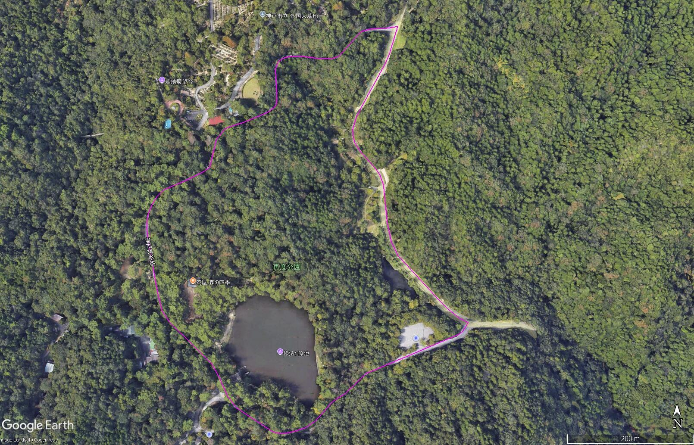

---
<!-- _class: media -->

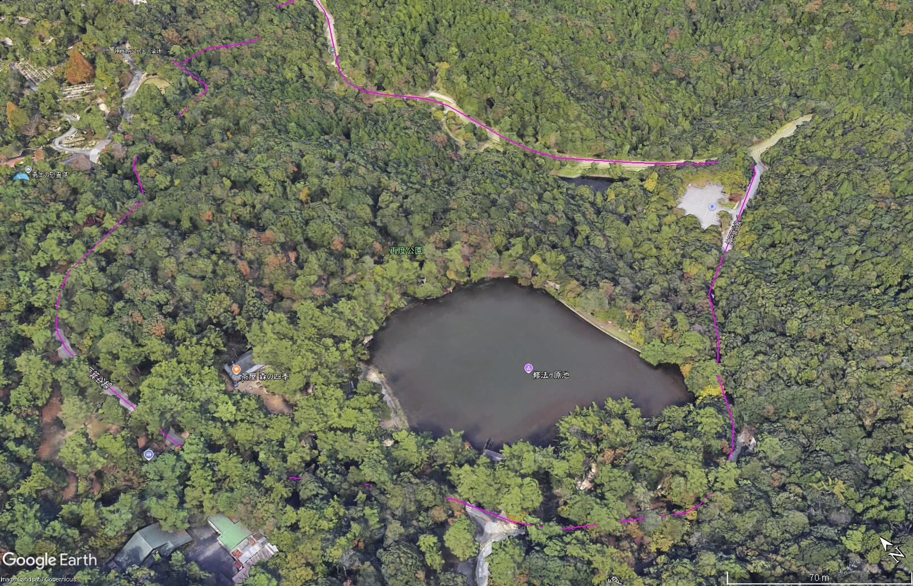

---
<!-- _class: media -->

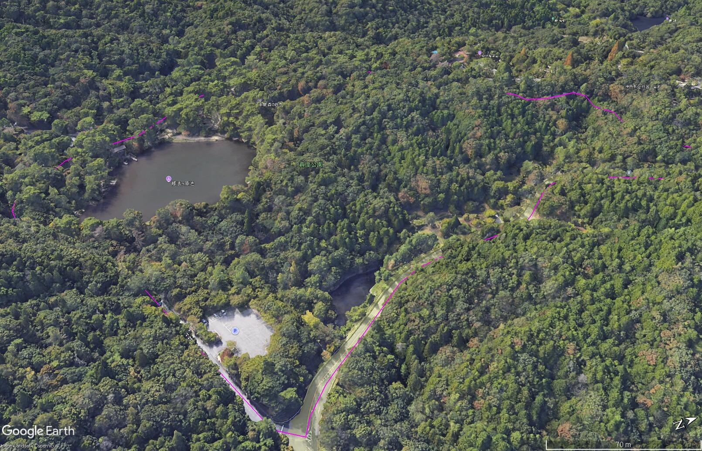

---
<!-- _class: media -->

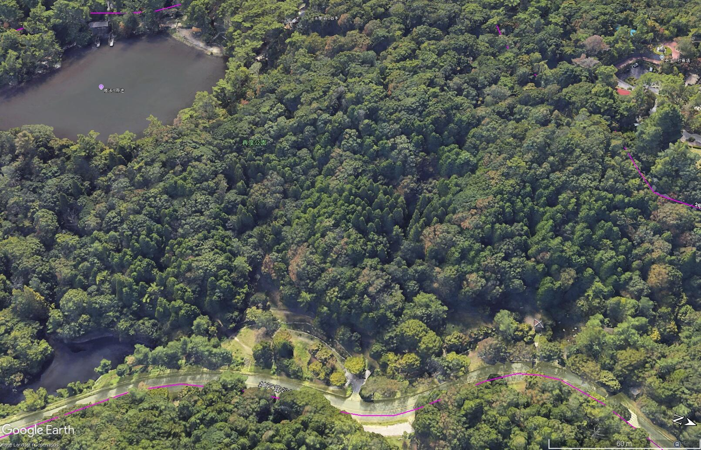

---
<!-- _class: media -->

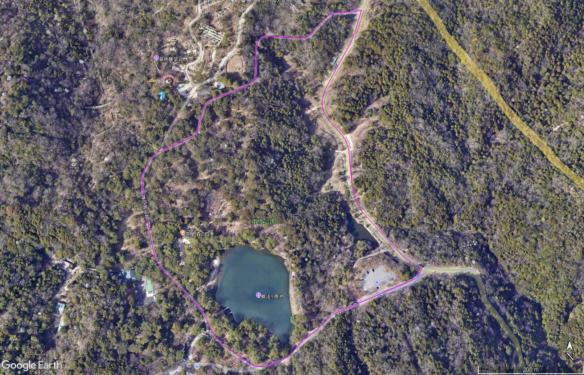

---
<!-- _class: media -->

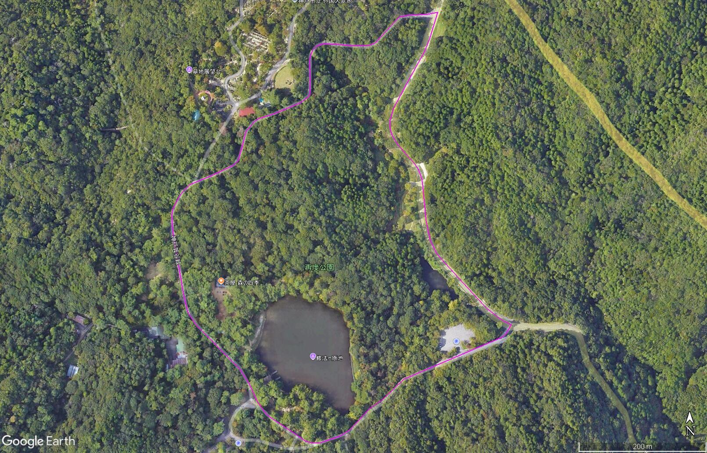

---
<!-- _class: media -->

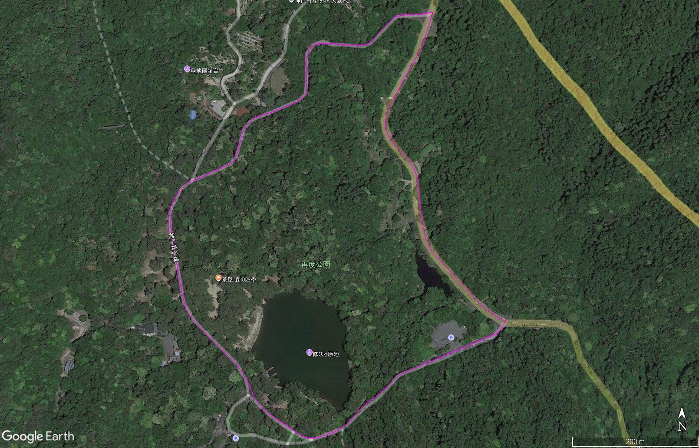

---
<!-- _class: content -->

## 再度公園の範囲
- 神戸市HP面積とGIS概算面積（12.9ha）の差異

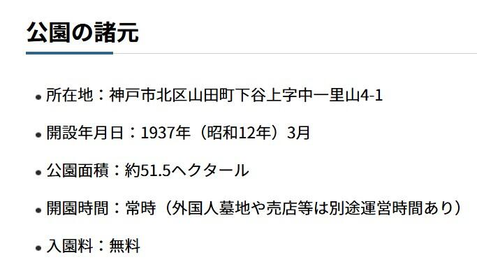

  
出典: 神戸市（2025）『再度公園（ふたたびこうえん）』 https://www.city.kobe.lg.jp/a17526/kurashi/machizukuri/park/intoro/kobepark/futatabi.html

---
<!-- _class: content -->

## 瀬戸内海国立公園の広がり
- 再度公園は瀬戸内海国立公園の一角に位置する
- 広域的な配置を把握し、周辺の自然環境とのつながりを意識する

---
<!-- _class: media -->

  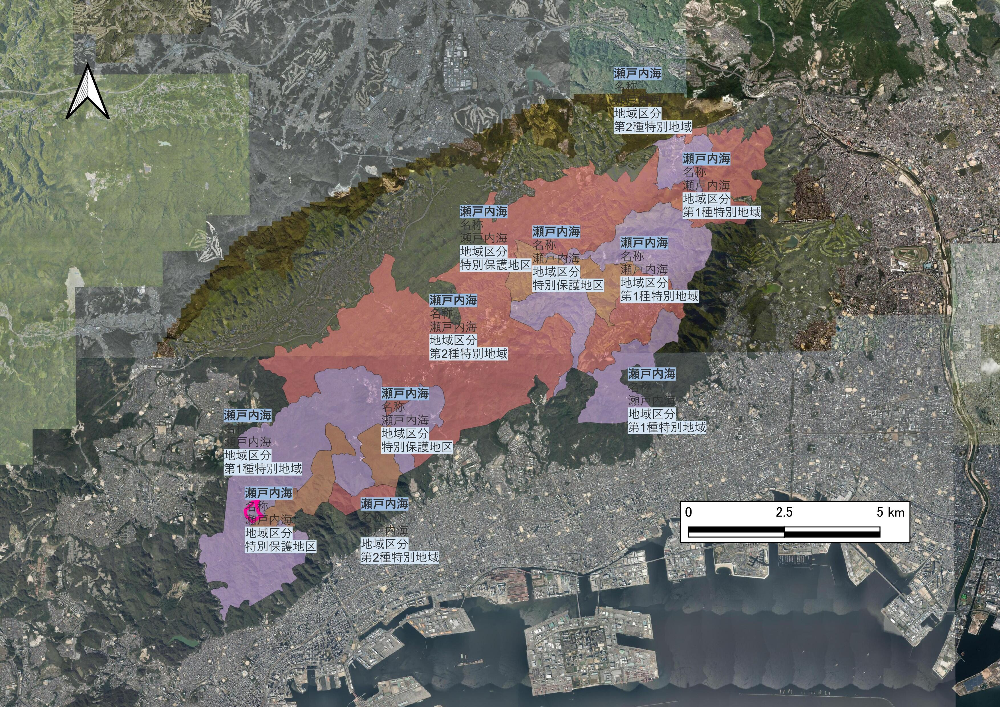

<footer class="source-note">
  
作図: 渡邉大輔（2025年、瀬戸内海国立公園の指定区域を基に作成）

</footer>

---
<!-- _class: content -->

## 第一種特別地域としての位置づけ
- 再度公園は第一種特別地域に指定され、自然状態の維持が最優先

<!-- NOTE: 130_瀬戸内海国立公園_focus が提供されていないため、広域図を補完資料として参照 -->

  
出典: 環境省（発行年不明）『自然公園法の概要』 https://www.env.go.jp/content/000062513.pdf

  
出典: 環境省（発行年不明）『国立・国定公園特別地域内での各種行為に係る許可基準の概要』 https://www.env.go.jp/nature/ari_kata/shiryou/031208-4-14.pdf

  
出典: 兵庫県（発行年不明）『自然公園内での行為に関する処理基準』 https://www.kankyo.pref.hyogo.lg.jp/application/files/7616/4145/7093/2_.pdf

  
出典: 兵庫県（発行年不明）『自然公園の概要制度』 https://www.kankyo.pref.hyogo.lg.jp/application/files/9416/3816/0342/30193e7a4b7163dbd925c6f52287fa6f.pdf

---
<!-- _class: content -->

## 法規制・保全の枠組
- 国立・国定公園の中で、自然景観が最も優れた区域
- 自然状態の維持を最優先に、開発行為は原則禁止
- 自然公園法第20条に基づき、特別地域の中で最も厳格な区分
- 工作物・伐採・土地改変などは原則不可、許可制
- 学術・教育・観察利用など、環境を損なわない行為のみ許容

  
出典: 環境省（発行年不明）『自然公園法の概要』 https://www.env.go.jp/content/000062513.pdf

  
出典: 環境省（発行年不明）『国立・国定公園特別地域内での各種行為に係る許可基準の概要』 https://www.env.go.jp/nature/ari_kata/shiryou/031208-4-14.pdf

  
出典: 神戸市（2022）『六甲山 利活用ガイドライン』 https://www.city.kobe.lg.jp/documents/64246/tenpu_02.pdf

  
出典: 兵庫県（発行年不明）『自然公園内での行為に関する処理基準』 https://www.kankyo.pref.hyogo.lg.jp/application/files/7616/4145/7093/2_.pdf

  
出典: 兵庫県（発行年不明）『自然公園の概要制度』 https://www.kankyo.pref.hyogo.lg.jp/application/files/9416/3816/0342/30193e7a4b7163dbd925c6f52287fa6f.pdf

---
<!-- _class: content -->

## 再度公園の管理等
- 再度公園は「再度山永久植生保存地」を核とする区域で、森林保全を目的とした区域指定
- 開設は1937年（昭和12年）、人工池（修法ヶ原池）を含む風致的・休養的施設を併設した都市公園として整備された
- 緑化事業の歴史的経緯が記載：明治35年（1902年）から斜面工・石積み補強・多様樹種植栽による再緑化が始まった
- 市民参加型の「森づくり」活動、定期的な植生・土壌調査（5年ごと）が計画管理の枠組みに入っていた
- 植生の遷移・管理方針として、「アカマツ／コナラ主体の二次林の整備・間伐・低木刈込・照葉樹遷移維持」などの手法が挙げられる

  
出典: 文化庁（発行年不明）『再度公園・再度山永久植生保存地・神戸外国人墓地（文化遺産オンライン）』 https://bunka.nii.ac.jp/heritages/detail/174035

  
出典: 神戸市（2025）『国名勝「再度公園・再度山永久植生保存地・神戸外国人墓地」』 https://www.city.kobe.lg.jp/a17526/kanko/leisure/mountain/futatabi.html

---
<!-- _class: divider -->

# 観察記録から読み取れること

---
<!-- _class: content -->

## 兵庫きのこ研究会の記録
- 全国各地できのこ観察会が実施
- 再度公園の活動はレベルが高い
- 観察記録が継続的に蓄積

---
<!-- _class: media -->

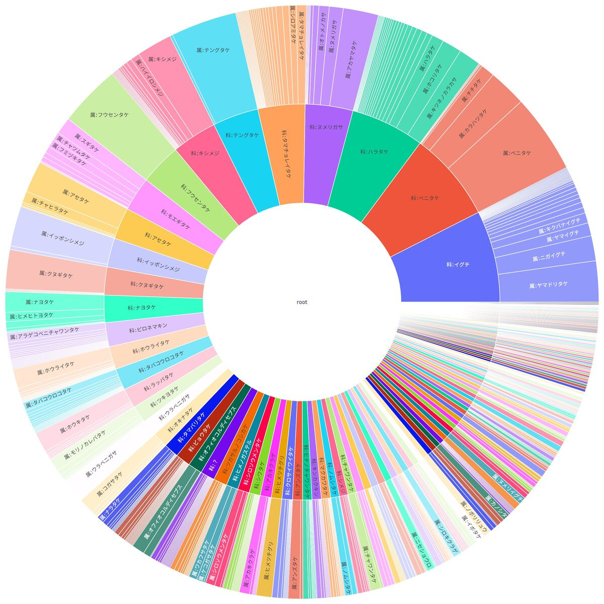

  
とりまとめ: 幸徳 氏

---
<!-- _class: media -->

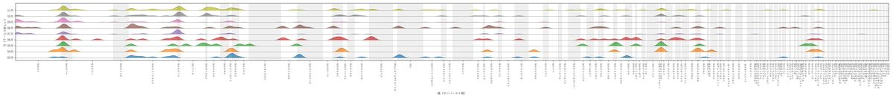

  
とりまとめ: 幸徳 氏

---
<!-- _class: content -->

## 感想と今後の展望
- せっかくの貴重なデータがある、これを活かしていきたい
- 降水との相関が見れたらいいな（余裕があれば降水関係の図を挿入）

