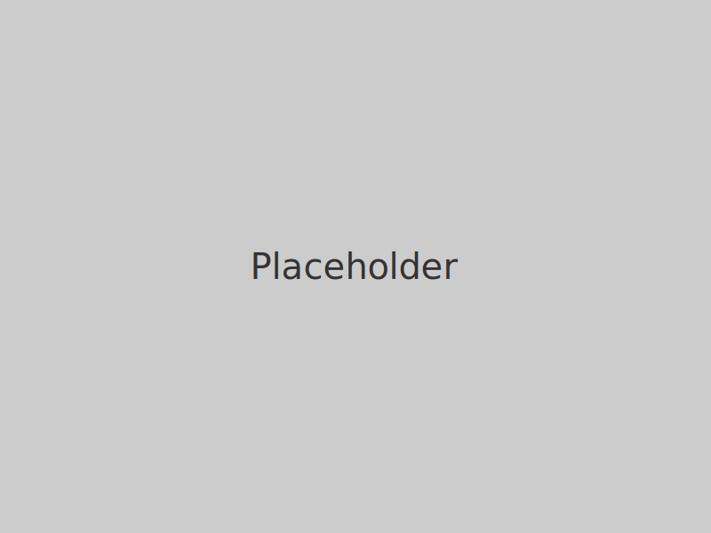

<!-- _class: cover -->
<!-- _paginate: skip -->

# 再度公園における素敵なきのこ観察
## 場所を知る／データから見る
### 発表者・日付

---
<!-- _class: content -->

## 目的と今日の流れ
- 目的①：再度公園という“舞台”を知る
- 目的②：観察データから見えることを探る
- 本日の流れ：場所→制度→自然→データ→示唆

---
<!-- _class: content -->

## きのこ観察会の広がり（全国の文脈）
- 全国でも観察会は各地で実施
- 再度公園の活動はレベルが高い印象

---
<!-- _class: content -->

## 再度公園の位置と概要
- 神戸中心部からの距離／アクセス
- 面積（公称）とエリア感

 

---
<!-- _class: content -->

## 面積・境界のちょい深掘り
- 神戸市HPの面積 vs GISの概算差異に言及
- 差異の理由（計測範囲・境界定義などの可能性）

---
<!-- _class: content -->

## 自然の側面：植生の概要
- 主要な植生タイプ（例：常緑広葉・二次林など）
- 「観察で出やすい環境」への示唆

---
<!-- _class: content -->

## 法規制・保全の枠組み（要点だけ）
- 瀬戸内海国立公園の一部（区域の位置づけ）
- 第一種特別地域など：保全の方針
- きのこ採取の扱い（木竹伐採NG等との対比に軽く触れる）

---
<!-- _class: content -->

## 計画・管理の視点
- 公園計画書等の要点（自然性重視・利用と保全の両立）
- ⇒ 再度公園は“価値が認められ、適切に守られている場”

---
<!-- _class: content -->

## ここまでのまとめ（観察の意義）
- 自然度 × 管理のバランスが良い“学びの場”
- 継続観察の価値：季節差・年差・場の特徴が見える

---
<!-- _class: divider -->

# データ分析編

---
<!-- _class: content -->

## データの宝：兵庫きのこ研究会の記録
- 観察記録が継続的に蓄積（=資産）
- 兵庫県の確認種リストが基準として有用
- 注意点：大量発生度・同定体制の揺れ等のバイアス

---
<!-- _class: content -->

## 手元でやった簡易集計（例）
- 各観察会ごとの確認種数を集計
- 月ごとの傾向を比較（棒グラフ想定）
- ざっくり見える季節性

---
<!-- _class: content -->

## 気象との関係の仮説
- 降水量（アメダス近傍）× 確認種数の散布図
- 期待：降雨後に種数↑の傾向？（※年・月で差）
- 限界：観察回の偏り／探索努力量の差

---
<!-- _class: split -->

### 観察の工夫
- 現地でのメモ統一
- 探索時間の記録

### 分析の工夫
- データの整形
- 気象データとの照合

---
<!-- _class: content -->

## 見えたこと＆次にやりたいこと
- 視覚化で“場と季節の癖”が見え始めた
- もっと良くする：地点メモ統一・探索時間の記録・同定体制の注記
- 皆さんのアイデア募集（分析の観点／記録の工夫）

---
<!-- _class: media -->

---
<!-- _class: content -->

## さいごに
- 再度公園×きのこ観察の魅力再確認
- データの継続が未来の知見に
- ご協力への感謝・連絡先

